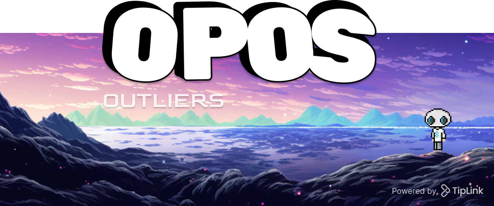

This project was built for the Only Possible on Solana hackathon to showcase the power of compressed NFTs and TipLink.

🔗 [opos.quest](https://opos.quest)

[
](https://discord.gg/NKqKE5tzSw)[
](https://twitter.com/TipLinkOfficial)

### ❔Request Attributes
Reach out to us in Discord in order to request new attributes or submit art files.

### ❔ How it Works
1. User customizes their character which the app saves in `useCharacterDesign` context.
2. As user is changing attributes, the `useGenerateMedia` hook calls the `generateMedia` server action to dynamically generate and composite images to show the asset preview in two formats, full body and cropped PFP.
3. Once user clicks mint, the `useStageMint` hook is used to generate media and metadata, upload both of those to Shadow, and return the uploaded metadata JSON `uri`.
4. After metadata has been staged, the `useMintStaged` is used to mint the staged details and create the new asset. During this process, the [TipLink SDK](https://tiplink-docs.vercel.app/) is used to create a new TipLink wallet and set the new wallet as the owner of the new cNFT.
5. The browser redirects to the URL of the newly created TipLink where the user is presented with multiple ways to claim the NFT such as sign in with Gmail or send to public key.

## Develop
*Made with NextJS*
[](https://nextjs.org/)
### Setup Environment
Copy/paste the `.env.template` file in the root of the project, rename it `.env` and fill in the following values for your context.
```
RPC_URL
solana rpc url.

MERKLE_TREE
public key string to your existing merkle tree.

PAYER_KEYPAIR
full keypair of the fee payer that will mint.

SHADOW_ACCOUNT
public key to an existing shadow account for the fee paier to upload to.

COLLECTION_MINT
Public key of the collection you're minting to.

COLLECTION_METADATA_ACCOUNT
Public key of the collection metadat account. 

COLLECTION_MASTER_EDITION_ACCOUNT
Public key of the master edition account. 
```

### Quickstart
Ensure NPM is installed, clone the repo, run the following in the root of the project.

```bash
npm i
npm run dev
```

### Config
📄 `@/config`
The config file defines values used for minting such as tree details, collection details, metadata, attribute definitions.

### Hooks
📂 `@/hooks`
Adapt server actions to React state.
- `useCharacterDesign`: The core state of the app that exports the main provider used in `/app/page.tsx`.
- `useFetchable`: Generic fetch data hook.
- `useGenerate`: Generate images and metadata.
- `uesMint`: Mint a new cNFT to the merkle tree.

### Actions
📂 `@/actions`
Server actions for doing things like minting NFTs, compositing images, querying stats.

### Attribute Assets
📂 `@/publis/attributes`
Where attribute assets are stored.
- When updating an asset file, you might have to add some URL param to break Vercel cache to pickup the change.
- Atribute layers are 640x640 px.
- If adding a new attribute, be sure to add it to `@/config`.


## On-Chain Setup
### Creating a Merkle Tree
[wip]

### Creating a Collection
[wip]

### Minting Compressed NFTs
[wip]


